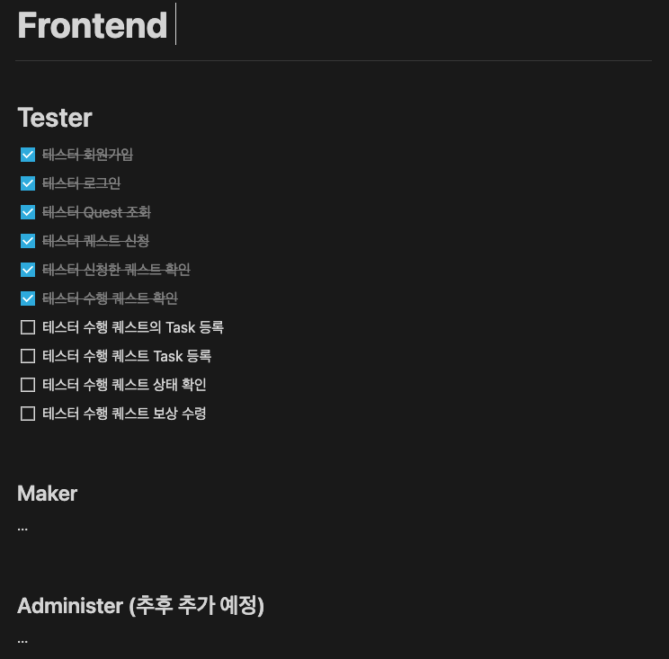

# tester_matching_platform_front
Tester Matching Platform Front Part 입니다.

## 기술 스택
- Vue.js
- Vue Router
- Vuex
- Axios
- Vue Test Util


## 개발 환경
- Chrome 개발자 도구
- Github
- Vue Chrome Plugin
- IntelliJ 사용

## 진행사항

테스터 수행 퀘스트를 등록하고 있습니다.

Tester 전체 기능들에 대해서 정리하고 있습니다.


## Project setup
```
npm install
```

### Compiles and hot-reloads for development
```
npm run serve
```

### Compiles and minifies for production
```
npm run build
```

### Lints and fixes files
```
npm run lint
```
- eslint + prettier사용

### Customize configuration
See [Configuration Reference](https://cli.vuejs.org/config/).
